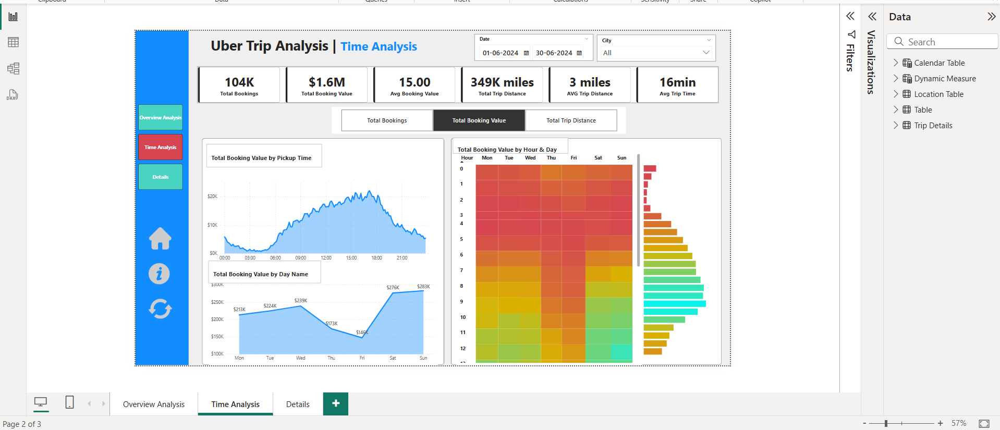

# Uber Trip Analysis Power BI Dashboard

**Designed & Developed by:** Uddeishya Kumar

---

## Table of Contents

1. [Project Overview](#project-overview)  
2. [Business Requirements & Objectives](#business-requirements--objectives)  
3. [Key Performance Indicators (KPIs)](#key-performance-indicators-kpis)  
4. [Data Model & Sources](#data-model--sources)  
5. [Power BI Dashboard Structure](#power-bi-dashboard-structure)  
   - [Dashboard 1: Overview Analysis](#dashboard-1-overview-analysis)  
   - [Dashboard 2: Time Analysis](#dashboard-2-time-analysis)  
   - [Dashboard 3: Details (Grid) Tab](#dashboard-3-details-grid-tab)  
6. [Dynamic Measures & User Interactivity](#dynamic-measures--user-interactivity)  
7. [Visualizations & Enhancements](#visualizations--enhancements)  
8. [Implementation Steps](#implementation-steps)  
9. [Prerequisites & Setup](#prerequisites--setup)  
10. [Usage & Drill-Through](#usage--drill-through)  


---

## Project Overview

This Power BI solution ingests Uber trip data to deliver a comprehensive analytics dashboard. Stakeholders gain actionable insights into booking trends, revenue performance, trip efficiency, and spatial-temporal patterns. The modular design allows business users to interactively slice data by time, location, vehicle type, and payment method to support data-driven decisions.

---

## Business Requirements & Objectives

- **Analyze booking trends & revenue** over configurable date ranges.  
- **Measure trip efficiency** by distance and duration.  
- **Identify spatial hotspots** for pickups/drop-offs and optimize driver distribution.  
- **Detect temporal demand patterns** (hourly, daily, weekday vs. weekend).  
- **Enable drill-through & raw data export** for detailed investigations.  

---

## Key Performance Indicators (KPIs)

| KPI                         | Definition                                                         |
|-----------------------------|--------------------------------------------------------------------|
| **Total Bookings**          | Count of all rides booked in the selected period.                  |
| **Total Booking Value**     | Sum of fare revenues for all trips.                                |
| **Average Booking Value**   | Total Booking Value ÷ Total Bookings.                              |
| **Total Trip Distance**     | Sum of distances covered (in km or mi).                            |
| **Average Trip Distance**   | Total Trip Distance ÷ Total Bookings.                              |
| **Average Trip Time**       | Mean duration (in minutes) of all trips.                           |

---

## Data Model & Sources

- **Primary Dataset**: Uber trip logs with fields  
  – Trip ID, DateTime (Pickup & Drop-off), Distance, Duration, Fare, Payment Type, Vehicle Type, Pickup & Drop-off Locations  
- **Data Model**:  
  – Fact table: `Trips`  
  – Dimension tables: `Date`, `Time`, `VehicleType`, `PaymentType`, `Location`  
- **Relationships**:  
  – Trips ➔ Date (1-to-many)  
  – Trips ➔ Time (1-to-many)  
  – Trips ➔ VehicleType, PaymentType, Location (many-to-one)  
- **Inactive Relationship**:  
  – PickupLocation ↔ DropoffLocation (activated dynamically for “Most Frequent Drop-off” analysis)

---


## Power BI Dashboard Structure

### Dashboard 1: Overview Analysis

- **Purpose**: High-level snapshot of ride volumes, revenues, and efficiency metrics.  
- **Components**:  
  1. **Measure Selector** (Disconnected table) for dynamic KPI visuals:  
     - Total Bookings  
     - Total Booking Value  
     - Total Trip Distance  
  2. **Charts by**:  
     - Payment Type (Card, Cash, Wallet, etc.)  
     - Trip Type (Day vs. Night)  
  3. **Vehicle Type Grid** (Matrix): KPIs by vehicle category with conditional formatting.  
  4. **Daily Booking Trend** (Line/Area): Trips per day with peak/off-peak annotation.  
  5. **Location Analysis**:  
     - Top 5 Pickup & Drop-off Points  
     - Farthest Trip Distance  
     - Preferred Vehicle per Pickup Location
---


### Dashboard 2: Time Analysis

- **Purpose**: Drill into demand patterns over time intervals.  
- **Components**:  
  1. **Global Dynamic Measure** applies across all visuals.  
  2. **10-Minute Interval Area Chart**: Trips aggregated by 10-minute buckets.  
  3. **Weekday Trend Line Chart**: Daily totals Mon–Sun.  
  4. **Heatmap** (Matrix): Hours (0–23) × Days (Mon–Sun) colored by selected KPI.
---





### Dashboard 3: Details (Grid) Tab

- **Purpose**: Provide granular trip-level data with drill-through from other dashboards.  
- **Features**:  
  - **Grid Table**: Shows Trip ID, DateTime, Distance, Duration, Fare, VehicleType, PaymentType, Locations.  
  - **Drill-Through**: Right-click on any chart data point → navigate here with filters applied.  
  - **Bookmarks**:  
    - **View Full Data**: Toggle between filtered and unfiltered grid.  
    - **Data Details**: Pop-up panel explaining metrics, data sources, and refresh cadence.

---


## Dynamic Measures & User Interactivity

- **Disconnected Table** named `MeasureSelector` with values:  
  - “Total Bookings”  
  - “Total Booking Value”  
  - “Total Trip Distance”  
- **DAX Measure**:  
  ```DAX
  Selected KPI = SWITCH(
    TRUE(),
    SELECTEDVALUE(MeasureSelector[Metric]) = "Total Bookings", [Total Bookings],
    SELECTEDVALUE(MeasureSelector[Metric]) = "Total Booking Value", [Total Booking Value],
    SELECTEDVALUE(MeasureSelector[Metric]) = "Total Trip Distance", [Total Trip Distance]
  )

## Visualizations & Enhancements
- **Slicers**  
  - Date  
  - City  
  - Vehicle Type  
  - Payment Type  

- **Tooltips**  
  Show complementary metrics (e.g., Average Booking Value) on hover.

- **Conditional Formatting**  
  Highlight top- and bottom-performing values in tables.

- **Buttons & Bookmarks**  
  - **Clear Filters** — resets all slicers to their defaults  
  - **Download Raw Data** — exports current view as CSV/Excel via Power Automate  
  - **Data Details** — opens a pop-up with metric definitions, source info, and refresh cadence  

---

## Implementation Steps

1. **Import Data** into Power BI Desktop.  
2. **Define Dimension & Fact Tables**, then set up relationships.  
3. **Create Disconnected Table** named `MeasureSelector`.  
4. **Develop DAX Measures** for each KPI and for the dynamic selector.  
5. **Build Visuals** according to the dashboard specifications.  
6. **Configure Drill-Through** on the Details (Grid) page.  
7. **Add Bookmarks & Buttons** for enhanced UX (clear filters, export, data details).  
8. **Publish** the PBIX to Power BI Service and configure the scheduled dataset refresh.

---

## Prerequisites & Setup

### Software
- Power BI Desktop (latest stable release)  
- Power BI Pro or Premium (for publishing)

### Data Access
- Connection to Uber trip data (CSV, SQL database, or Azure Data Lake)

### Permissions
- Publish rights on the target Power BI workspace  
- Access to Power Automate (to enable the Download Raw Data button)

---

## Usage & Drill-Through

1. **Select a KPI** using the Measure Selector in the top-left corner.  
2. **Adjust Filters** via the slicers (Date, City, Vehicle Type, Payment Type).  
3. **Interact with Charts**  
   - Hover for tooltips  
   - Right-click a data point → **Drill Through** → Details  
4. **Reset All Filters** by clicking the **Clear Filters** button.  
5. **Export Data** by clicking the **Download Raw Data** button.  
